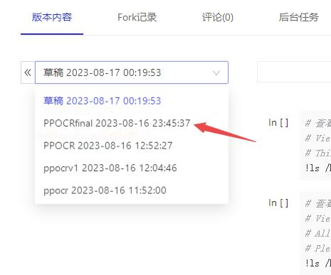

# baipiaoOCR

旨在白嫖paddleOCR训练好的模型用于部署使用。

将 paddleOCR 转 torchOCR, 支持ppocr-v3,ppocr-v4转torch, onnx, openvino。

### 快速开始，运行下面命令，一键转成torch和onnx和openvino，支持ppOCR-v3和ppOCR-v4。

```
cd OCRModules-V3 or cd OCRModules-V4
sh install.sh
```

### 测试

运行完后会生成一个serviceOCRModule模块，基于openvino的这个模块可以直接用于OCR实际应用开发，测试这个模块：
```
python test_serviceOCRModule.py
```

### 其他测试，支持pytorch GPU调用，onnx调用，openvino调用，例子都在下面
```
python test_cls.py
python test_detect.py
python test_recog.py
```
### 使用aistudio测试该项目
https://aistudio.baidu.com/projectdetail/6645344?contributionType=1
我这里提供一个aistudio，大家可以去fork，选择PPOCRfinal版本，使用免费资源的基础版环境即可，使用GPU版本不能使用torch。




### 训练

你可以用paddleOCR训练这三个模型，训练完后，把模型拷贝到对应的origin_model_dir/ppocr_weights里面，然后一键转换。

### 参考文献

https://github.com/PaddlePaddle/PaddleOCR